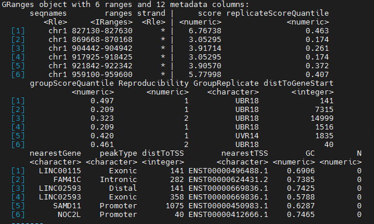
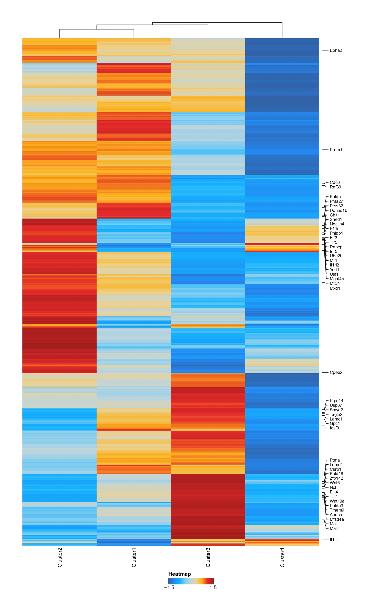
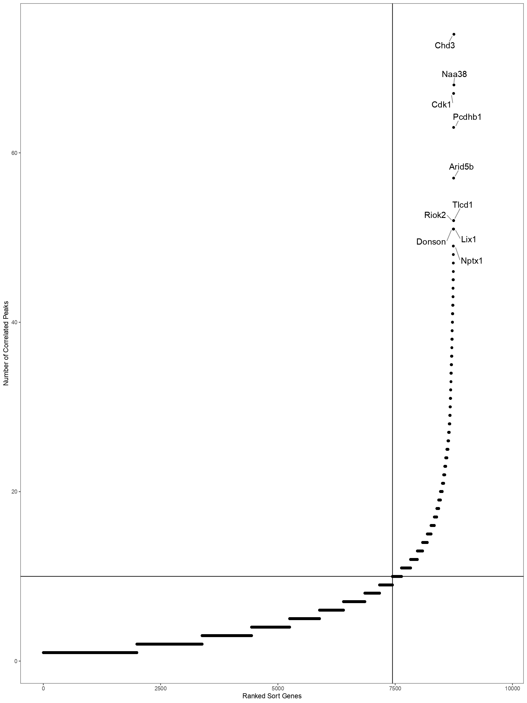
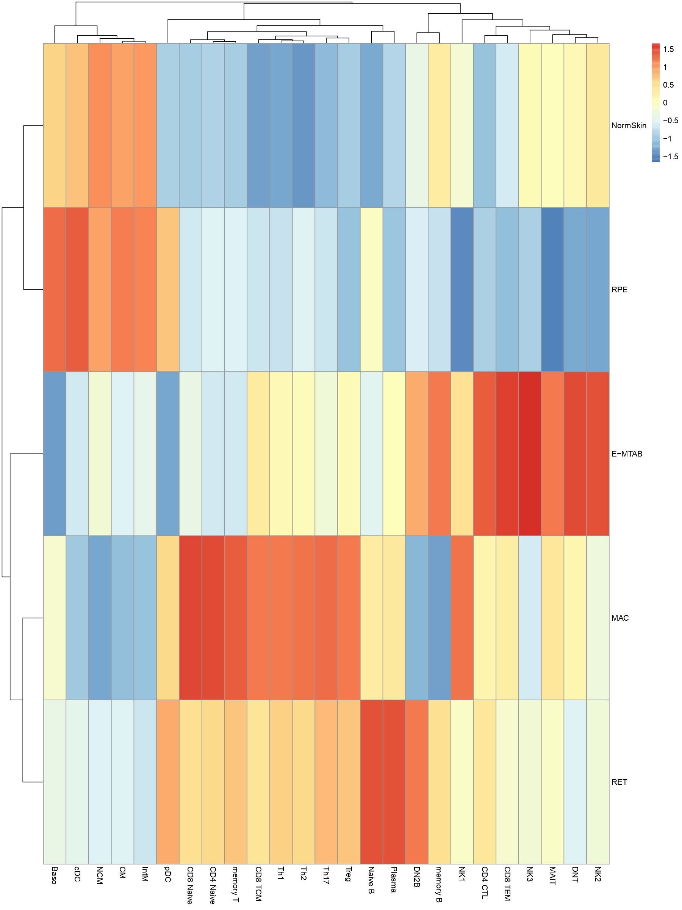

# find2Kat
some functions for bed or Bam files ,or Granges object
### Description
Find2Kat this package, can implement calleak and annote bam, bed file, but also can implement the ArchR object DORC score calculation (generally only on the share-seq data), as well as can achieve the correlation between cell type and disease and so on
...

### installtation
```r
install.packages("find2Kat_0.2.0.tar.gz")
```
you also need to install depend packages via *require-packages.txt*

### callpeak for BAM or BED file and annotation
you can use function **annoteFile** reliaze
```r
annoteFile(File="yourPathOfFiles",Names="relativeNames",blacklist=find2Kat::blacklist[["hg38"]],genome="hg38",...)
```
and the result like follow 



### DOCR Score
**getDORCXMatrix** function can get  DORC score(it will take many minutes...);and **DOCRPointPlot** can show DORC Rank gene scatter plot

reliaze it via code
```r
dorcList=getDORCXMatrix(projHeme)
x=dorcList[["CellTypeDORC"]]
colData=data.frame("Clusters"=colnames(x))
ArchRHeatmap(mat=as.matrix(x),colData=colData,showRowDendrogram=TRUE,scale=TRUE,customRowLabel =c(1,3,5,7))
```

reliaze it via code
```r
DOCRPointPlot(p2g,genes=genes,nShowGenes=10,..)
```
detail can refer to function help

### celltype to Disease
how to related CellType to Disease
```r
chromVARSNPpipeline(...)
```


### Link to TF
```r
getP2GLinks(...)
link2TF(...)
```
### Issues using yipCat?
If this does not fix your problem, please [report an issue on Github](https://github.com/RyanYip-Kat/find2Kat/issues) with the __Bug Report__ form.
